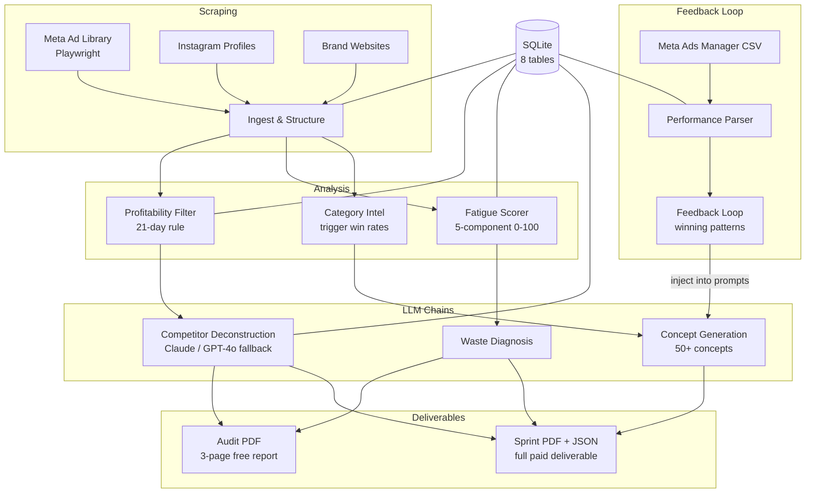

# D2C Creative Intelligence Pipeline

Solo-operator AI pipeline that scrapes **Meta Ad Library**, analyses competitor ads via multimodal LLMs, and generates strategic ad creative concepts for Indian D2C brands (INR 1-50Cr revenue band).

One pipeline, three outputs:
- **Creative Concepts** -- 50+ data-driven ad concepts per sprint
- **Competitor Intel** -- Psychological trigger analysis, format breakdowns, winner identification
- **Ad Waste Audits** -- Free 3-page PDF audit used for client acquisition

## Architecture



## Quick Start

```bash
# 1. Clone and create virtual environment
git clone <repo-url> && cd Creative_Intelligence_Service
python -m venv cisenv
source cisenv/Scripts/activate   # Git Bash on Windows
# or: cisenv\Scripts\activate    # cmd on Windows
# or: source cisenv/bin/activate # macOS/Linux

# 2. Install dependencies
pip install -r requirements.txt
playwright install chromium

# 3. Set up environment variables
cp .env.example .env
# Edit .env with your API keys (see below)

# 4. Initialise the database
python config.py

# 5. Run your first audit
python pipeline.py audit \
  --brand "Mamaearth" \
  --competitors "Plum,WOW Skin Science,mCaffeine" \
  --category skincare
```

## Environment Variables

Create a `.env` file in the project root:

```env
# Required -- at least one LLM key
ANTHROPIC_API_KEY=sk-ant-...
OPENAI_API_KEY=sk-...

# Optional -- override defaults
ANTHROPIC_MODEL=claude-opus-4-6
OPENAI_MODEL=gpt-4o
LLM_TEMPERATURE=0.7
LLM_MAX_TOKENS=4096

# Scraper tuning
SCRAPER_DELAY_MIN=2
SCRAPER_DELAY_MAX=5
SCRAPER_TIMEOUT=30

# Paths (usually fine as defaults)
DATA_DIR=data
DB_PATH=d2c_intel.db
```

## Pipeline Modes

### 1. Audit (free lead-gen PDF)

Scrapes competitors, analyses ads, generates a 3-page Creative Waste Audit PDF.

```bash
python pipeline.py audit \
  --brand "Mamaearth" \
  --competitors "Plum,WOW Skin Science" \
  --category skincare \
  --output audits/
```

### 2. Sprint (paid deliverable)

Everything in audit + 50 concept generation + full sprint PDF with creative calendar.

```bash
python pipeline.py sprint \
  --brand "Mamaearth" \
  --competitors "Plum,WOW Skin Science" \
  --category skincare \
  --num-concepts 50 \
  --output sprints/
```

### 3. Batch Audit (CSV-driven)

Run audits for multiple brands from a CSV file.

```bash
python pipeline.py batch-audit \
  --brands-file brands_to_audit.csv \
  --category skincare \
  --output audits/
```

CSV format:
```csv
brand_name,competitors,category
Mamaearth,"Plum,WOW Skin Science",skincare
mCaffeine,"The Ordinary,Dot & Key",skincare
```

### 4. Refresh (re-scrape + diff)

Re-scrape an existing brand, show what changed, generate new concepts.

```bash
python pipeline.py refresh --brand "Mamaearth"
```

### Dry Run

Add `--dry-run` to any mode to preview steps without scraping or calling LLMs:

```bash
python pipeline.py audit --brand "Mamaearth" --competitors "Plum" --dry-run
```

## Individual Modules

Each module can be run standalone:

```bash
# Scraping
python -m scrapers.meta_ad_library --brand "Mamaearth" --competitors "Plum,WOW"
python -m scrapers.instagram_profile --handle maabornindia
python -m scrapers.brand_website --url "https://mamaearth.in" --brand "Mamaearth"

# Deliverables
python -m deliverables.audit_generator --brand "Mamaearth" --output audits/
python -m deliverables.sprint_generator --brand "Mamaearth" --output sprints/

# Feedback loop
python -m feedback.performance_parser --file export.csv --brand "Mamaearth"
python -m feedback.loop --category skincare
python -m feedback.loop --brand "Mamaearth"
```

## Cost Estimates

LLM costs per run (using Claude Opus as primary, GPT-4o as fallback):

| Operation | Approx Tokens (in/out) | Est. Cost (Claude) | Est. Cost (GPT-4o) |
|-----------|----------------------|-------------------|-------------------|
| Single ad analysis (with image) | ~2K / ~1K | $0.11 | $0.025 |
| Waste diagnosis | ~4K / ~2K | $0.21 | $0.05 |
| Concept generation (50 concepts) | ~6K / ~8K | $0.69 | $0.15 |
| **Full Audit** (3 competitors x ~15 ads + waste + 5 hooks) | ~100K / ~50K | **$5.25** | **$1.25** |
| **Full Sprint** (audit + 50 concepts) | ~110K / ~60K | **$6.15** | **$1.50** |
| Batch audit (10 brands) | ~1M / ~500K | **$52.50** | **$12.50** |

Notes:
- Claude Opus pricing: $15/M input, $75/M output tokens
- GPT-4o pricing: $5/M input, $15/M output tokens
- Image tokens add ~1K tokens per image (varies by resolution)
- Actual costs depend on ad count and copy length
- The pipeline logs exact token usage and cost per call to stdout

## Feedback Loop (The Compounding Moat)

After running ads for 2-3 months, import performance data to make future concepts smarter:

```bash
# 1. Export CSV from Meta Ads Manager
# 2. Import it
python -m feedback.performance_parser --file meta_export.csv --brand "Mamaearth"

# 3. Run the feedback loop
python -m feedback.loop --category skincare

# Output: winning patterns text that gets injected into future concept_generation prompts
# - Which psychological angles get the best ROAS
# - Which hook structures stop the scroll
# - Which formats perform best per category
# - ROAS-weighted allocation for next batch
```

## Project Structure

```
scrapers/              Meta Ad Library + Instagram + brand site scrapers (Playwright)
  meta_ad_library.py   4-strategy ID extraction, pagination, retry+backoff
  instagram_profile.py JSON-first extraction, DOM fallback, engagement rate
  brand_website.py     httpx + BS4, Playwright fallback for JS pages
  utils.py             random_delay, load_selectors, download_image, safe_brand_slug

analysis/              Data structuring + scoring + intelligence
  structurer.py        ingest() for DB write, run() for dedup + diversity score
  profitability_filter.py  21-day rule, ranked winners, cross-competitor patterns
  fatigue_scorer.py    5-component fatigue score (0-100), competitor benchmarking
  category_intel.py    Trigger win rates, format performance, underused angles

llm/                   API client + prompt chains
  client.py            Claude primary / GPT-4o fallback, retries, cost logging
  chains.py            competitor_analysis, waste_diagnosis, concept_generation
  prompts/             Plain-text prompt templates (Template with $variables)

deliverables/          Output generation
  audit_generator.py   3-page PDF: cover, competitor comparison, sample hooks
  sprint_generator.py  Full sprint PDF + JSON sidecar

feedback/              Performance data + feedback loop
  performance_parser.py  Meta CSV parser, fuzzy concept matching
  loop.py              Angle/hook/format analysis, winning patterns, batch weights

db/schema.sql          8 tables: brands, ads, ad_analysis, competitor_sets,
                       creative_concepts, waste_reports, performance_data,
                       instagram_profiles

config.py              Central config, .env loader, DB init
pipeline.py            Main orchestrator (audit, sprint, batch-audit, refresh)
```

## Database Schema

8 tables with the `ads` table using a SQLite VIRTUAL generated column for `duration_days`:

- **brands** -- client and competitor brands with category
- **ads** -- scraped ad data with auto-computed `duration_days`
- **ad_analysis** -- LLM analysis results per ad
- **competitor_sets** -- client-competitor relationships
- **creative_concepts** -- generated concepts grouped by batch
- **waste_reports** -- fatigue scores and recommendations
- **performance_data** -- imported Meta Ads Manager metrics
- **instagram_profiles** -- scraped Instagram profile data

## Testing

```bash
pytest tests/ -v

# or via Make
make test
```

## Key Domain Concepts

| Concept | Definition |
|---------|-----------|
| Profitability proxy | Ads running 21+ days are flagged as probable winners |
| Fatigue signal | Ads running 30+ days without refresh = critical creative fatigue |
| Creative diversity score | 0-100 metric across 4 dimensions (format, copy, visual, volume) |
| Psychological triggers | status, fear, social_proof, transformation, agitation_solution, curiosity, urgency, authority, belonging, aspiration |
| Hook structures | question, number_lead, pattern_interrupt, direct_address, curiosity_gap, transformation, social_proof_lead, urgency_lead, authority_lead, bold_claim |

## License

Proprietary. All rights reserved.
